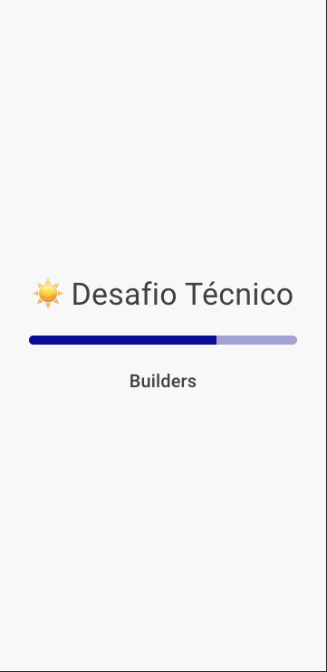
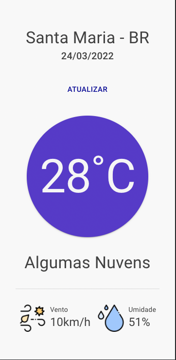

# ☀️ Desafio Técnico

🎯 Desenvolva um aplicativo que consuma a localização atual do usuário e exiba na interface o endereço atual os dados climáticos da região e um botão para atualizar os dados.

- Para fazer essa busca, pode-se usar a [API do Open Weather](https://openweathermap.org/api) Map.

## 📌 Condições

- Utilizar React
- É permitido o uso de outras libs
- Anexar `Print Screen` no Readme

---

## 📦 Outputs

- Repositório no [GITHUB](https://www.notion.so/GITHUB-4d23c6fae3f945bc82b7a3832f205d50)
- Documentação

---

## 🙌 Diferenciais

- Arquitetura
- Documentação
- Interface
- Testes

# Telas

 \_\_\_ 

# Scripts:

### yarn

```
Instala dependências.
```

### yarn start

```
roda o projeto.
```

### yarn test

```
roda os testes.
```

# Stacks:

`react`

`typescript`

`material-ui`

`react-query`

`axios`

`react-testing-library`

# Arquitetura:

Criei o projeto através do create-react-app com o template do typescript. Dentro da pasta src foi onde alterei a arquitetura.

## Pages:

```
Armazena todas as telas do projeto com o seus componentes.
```

## Routes

```
Local onde é definida as rotas do projeto.
```

## Shared/Assets:

```
Local onde fica todas as imagens do projeto.
```

## Shared/Components:

```
Local onde fica todos os components que podem ser usado em qualquer lugar da aplicação.
```

## Shared/Hooks:

```
Local onde fica todos os hooks da aplicação.
```

## Shared/Services:

```
Local onde configurei a minha chamada da api e criei os arquivos onde será feita as chamadas.
```

## Shared/Styles:

```
Local onde armazenarei o tema padrão e o layout base da aplicação.
```

## Shared/Utils:

```
Local onde armazenarei todas as funções que podem ser reaproveitadas no projeto.
```
